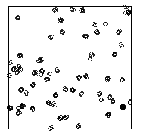

# Factorio_Cluster_Analysis
A spacial point process analysis of the enemy spawners in Factorio. <br/>
Whilst playing factorio, I realised that it might be possible to apply the topological data analysis I was currently studying. <br/>
<br/>
Below is a screenshot of the Factorio map, displaying hundreds of enemy bases (in red). <br/>


<br/>
And then by using the programming language Lua, you can extract features from the game server in the in-game console. <br/> 
So using the code below I was able to write all of the enemy base co-ordinates to the user data directory :) <br/>

<br/>

```
 local string = "Index, X, Y"
 for k, spawner in pairs (game.surfaces[1].find_entities_filtered{type = "unit-spawner"})
    do string = string.."\n"..k..", "..spawner.position.x..", "..spawner.position.y
 end 
 game.write_file("positions.csv", string)
```
<br/>
The extracted co-ordinates can be seen in the below figure
 <br/>
 <br/>

<br/>
And now we can take this data and use the "spatstat" library in R to analyse the data and fit it to a clustering process. <br/>
Plotting the pair correlation function below demostrates the clear clustering behavior the enemy bases possess, because for a low <br/>
distance, we can see there is a strong 'attraction' between enemy bases. <br/>
<br/>

<br/>
Fitting the data to a Matern cluster process, we get approximations of kappa = 0.00001 and scale = 20.3. <br/>
We can now generate new clusters of roughly the same distrubition!
<br/>
<br/>

<br/>
However, Matern cluster process does not encapsulate all the desired properties. The population of the enemy base clusters <br/>
seems dependent on the distance from the origin (further away gives bigger clusters), thus for a more accurate model we must <br/>
construct a gibbs process that also takes the distance to the origin as a parameter.
